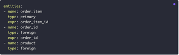

# Technology Stack
## [DBT](https://s.monica.im/search/I-require-a-zahwxrb5v4XuaSi2ZKavEb)

It’s a decoupled data analytics engine with processing in batch loads. The transformation runs within the data warehouse and data never exits its domain. Data transformations are replicable across different data environments.

DBT’s only function is to take code, compile it to SQL, and run it against the database.


### DBT Installation & Setup:
It’s SQL-first transformation workflow to quickly deploy analytics code in a modular pattern and allow data lineage capabilities.

DBT enables full version control and CI/CD capabilities throughout environments, which also brings the capacity to test and document each component, and the development aims to write modular data transformations in .sql or .py files – dbt handles the chore of dependency management. DBT's pre-packaged and custom testing helps developers create a “paper trail” of validated assumptions for data collaborators. Auto-generated dependency graphs and dynamic data dictionaries promote trust and transparency for data consumers.

DBT supports various databases and data warehouses, including PostgreSQL, BigQuery, Redshift, Snowflake, and more [[ref](https://cookjack248.medium.com/dbt-core-dbt-cloud-whats-the-difference-12993acc890a)]

#### DBT Cloud
Managed cloud environment for developing, testing, scheduling, and data mining on a well-provisioned web-based UI. https://www.getdbt.com/signup 

#### DBT Core
CLI for working with DBT projects either using a terminal or code editor like VSCode [[ref](https://docs.getdbt.com/docs/core/installation-overview)].


### DBT Models
The DBT  models act as blueprints of tables or views representing entities in a database created through SQL and Jinja. The runner then builds a DAG (Directed Acyclic Graph) against the data models to build the sequence of dependencies on how the models should be executed. The ``ref`` function allows the import of models as dependencies.

#### Key Components:
* Semantic layer: describes the data model, including model name, description, and references to other models.

  * **MetricFlow**: It’s responsible for SQL query construction and defines the specifications for DBT semantic models and metrics. It takes the information from the semantic models and metric YAML configurations to construct the SQL on-flight before running it within the data warehouse [[ref](https://docs.getdbt.com/docs/build/metricflow-commands)]. 

  * **Semantic Models**: serve as the foundation blocks of the semantic layer, which are built on top of existing DBT models to describe the data in a 1-to-1 relationship.

    * **Semantic model information**:  Includes model name, description, and the referenced DBT  model, default configurations, or aggregations. 

        

    * **Entities**: These are the foreign, primary, unique, or natural keys that make up the semantic model, and relate these entities across semantic models, enabling MetricFlow to perform joins dynamically. Entities require a ``name (unique name of the entity)`` and ``type (primary, foreign, unique, or natural)`` and give the option ``expr`` to define expression to reach the key on the other side of the entity. Entities are 1-to-1 relationships between semantic models, and they’ll reuse and handle by Metric flow to refactorize joins and relationships within dependent models.

        

    * **Measures**:  **_Dry (Do Not Repeat Yourself)_** controller over numerical columns to build metrics, these represent the aggregations that can be made to the model and bound to the metric. Each measure requires a ``name (unique name of the measure per model)`` and an ``agg (aggregation function to apply)`` but also provides a ``description (more detail)`` and ``expr (to aggregate under certain conditions)``.
  
        

    * **Dimensions**: Time-based or categorical attributes of the data. Dimensions only require a ``name(unique name of the dimension)`` and ``type (type, or categorical)``. For the time-based dimensions is necessary to provide ``time_granularity (day, year, month, …)``, and it’s possible to include the option ``expr`` that will be used to further transform the definition.

  * **Metrics**: metrics built on top of single or multiple semantic models, or use measures and metrics across multiple models by using joins. Metrics require a ``name(Unique identifier name)``, a ``label (Display name)``, a ``type (simple, cumulative, ratio, derived, or conversion)``, and ``type_params(parameters specific to each metric)``. It’s strongly recommended to include a description of each metric as well for additional context.

    * **Metric type – Simple**: These are metrics that point directly to a measure and they’re expressed by noting the measure as the type_params.
 
        

    * **Metric type – Cumulative**: Metrics that allow to aggregate a measure over an accumulation window. These calculations can often result in complex SQL, making MetricFlow's user-friendly interface a simpler alternative for creating these metrics. 

        Examples:

        * A running total, where you simply define the measure you want to total overall time. In this case, we’re calculating cumulative revenue:
 
            

        * A total over a specific window. You would use this if you want to define common weekly/monthly/daily active user-style metrics. The window parameter specifies the period you want to accumulate the metric over. In this case, we’re calculating Weekly Active Users.
 
            

        * A total using a grain_to_date. You would use this if you want to calculate a measure starting from a specific grain, like “Revenue - Year to Date .” The grain_to_date parameter describes over what grain to accumulate the metric. In this case, we are calculating the month-to-date (MTD) cumulative order total.
 
            

    * **Metric type – Ratio**: These metrics are calculated using a numerator and denominator to divide 2 METRICS. In this case, we are calculating the percentage of food revenue from total revenue.
 
        

    * **Metric type – Derived**: These metrics are defined as an expression (expr) of other metrics, which provides wide flexibility to metrics right for the organization. In this case, we are calculating profit by revenue cost, and you can also use derived metrics to do more advanced calculations.
 
        

    * **Metric type – Conversion**:  Allows to define when a base event and a subsequent conversion event happen for a specific entity within some time range. As an example, I can use a conversion metric to answer the following question: how many users visited my website and made a purchase within 7 days of their visit?
  
        
 
    Once the semantic models have been defined, tested, and deployed, this is an example of how to consume them using the API: 

    

* Metric Flow Query Generation: Once a user requests an analytics tool to drag and drop the metric revenue by the dimension customer_name, the DBT Semantic Layer takes the following steps:

    

    1.	The analytics tool turns this selection into an API request (in this example, we’re using the JDBC API).
    2.	Our API passes the request to the MetricFlow Server, which will use the semantic manifest to generate the full semantic graph of what can be queried. In this case, it will find that customer_name lives in a different semantic model than where revenue was defined, so it knows the SQL generated will have to include a join.

    3.	MetricFlow will generate the optimized SQL on the fly, which includes the join.

    4.	Our API gateway will execute it against the data platform and return the rows to the user in their analytics tool. Our underlying data platform support includes Snowflake, BigQuery, Redshift, and Databricks.

    The end user doesn’t see any of those steps. They simply initiate a request for data by selecting their metrics and dimensions, and the data is automatically populated in their analytics tool. However, if the user wants to dig in further, our APIs have a compile parameter, allowing you to see exactly what SQL is generated from the API request.

#### Modularity:
DBT promotes modular SQL queries through models, reflecting a company’s business logic. These data models are reusable and can be used as dependencies in a SQL-centric approach to creating a data mesh.

#### Version Control (VC):
DBT integrates seamlessly with VC systems like Git. To maintain track, revision, and rollback capabilities of all changes applied to the transformation logic.

#### CI/CD Integration:
DBT provides built-in CI/CD actions to integrate with any deployment pipeline.

#### Testing:
DBT allows to write tests in SQL to validate the results of the models. Defining expected outputs and comparing them with the actual results is possible. This ensures the accuracy and quality of the data and transformations before deploying them in productive environments.

#### Documentation:
DBT generates automatically the documentation of the semantic layer, this also includes adding Markdown comments in the SQL files to provide additional context to the model.

#### Extensibility:
DBT has a growing ecosystem of plugins that extend its functionality. These plugins provide additional features, integrations with other tools, and customization options.

#### Data lineage:
It works by capturing and storing metadata about data models, transformations, and dependencies in its internal catalog. Once the documentation is generated the lineage graph is generated to accompany it, showing a visual representation of the relationships between the data models, showcasing the interconnection and the data flow E2E.
 
 
Data lineage is defined by a DAG having each step of the DAG as a model or transformation, and the type of connection across them.

### Seeds
CSV or JSON files, which are used to load static or infrequently changing data into DBT to avoid having to reference the data from outside the tool every time it’s needed. It enables the data pipelines to easily refer to this fixed data across models, snapshots, sources, and tests.

Such seed files are stored in a designated directory within the project and can also be loaded into the DWH using the ``dbt seed`` command, which DBT accordingly to the **dbt_project.yml** will locate the CSV files and then load them into the corresponding tables within the DWH.

Creating a seed:
1.	Define the CSV or JSON files.

2.	Set up the seed paths within the **dbt_project.yml**.

3.	Run the command ``dbt seed`` in the CLI.

4.	Customize how the seed will be loaded and processed by defining configurations within the **dbt_project.yml**. This includes specifying how DBT should handle the keys and relationships in the seed data.

#### Scenarios:
* **Initial data loading**: It’s useful for loading initial dimension tables before applying transformations.

* **Reference data**: Seeds are valuable for storing reference data that is relatively static and does not require frequent updates. This data can include lists of airports, countries, or other reference information that serves as a foundation for analytics.

* **Easy replication**: Simplifies the process of replicating CSV or JSON files to the DWH and helps to maintain consistency in it.

* **Enhanced data consistency**: Seeds facilitate maintaining consistency across different models by providing a centralized location for storing common datasets. This helps ensure that multiple models or transformations are using the same initial data, reducing discrepancies and errors.

### Sources
Sources in DBT refer to raw data tables within the DWH and will serve as the foundation for data transformations. It is used with the function ``{{ source() }}`` to select source tables from the semantic models of the project. The sources have to be configured in the section sources within either the project file **dbt_project.yml**, the **properties.yml** file of the model, or by creating the **models/source.yml** file in the models’ folder.

Defining sources in DBT provides a reference point for the data transformations that follow, to maintain data lineage, ensure data integrity, and improve the quality of the analytics and the project. Besides, defining sources allows you to leverage the power of DBT features such as incremental models, materializations, and snapshots, which optimize the efficiency of your data workflows.

Source properties: https://docs.getdbt.com/reference/source-properties 

Variables can be referenced at this configuration level: https://docs.getdbt.com/reference/source-configs#conditionally-enable-a-single-source 

| **YAML Configuration structure** ||
| ---------------------------- | - |
| **Models/source.yml or Models/<< whatever model >>.yml** | **sources: at dbt_project.yml** |
|   |  |


### Snapshots
Allows to preserve points in time of the data to analyze trends and track changes. In DBT, snapshots are essentially select statements defined within a snapshot block in a .sql file, to register data states in mutable tables [[ref](https://docs.getdbt.com/docs/build/snapshots#configuring-snapshots)]

DBT provides options for handling data changes, such as snapshots for append tables. You can modify the logic as needed, without losing historical data, by using the --full-refresh command


It’s necessary to configure the snapshot to define how DBT will detect record changes, and the snapshots can be manually triggered or scheduled per time or event over condition met.

* **On the first run**: dbt will create the initial snapshot table — this will be the result set of your select statement, with additional columns including dbt_valid_from and ``dbt_valid_to``. All records will have a ``dbt_valid_to = null``.

* **On subsequent runs**: dbt will check which records have changed or if any new records have been created:

  * The ``dbt_valid_to`` column will be updated for any existing records that have changed.

  * The updated record and any new records will be inserted into the snapshot table. These records will now have ``dbt_valid_to = null``

Example of Snapshot creation:

1.	Create a file in your snapshots directory with a **.sql** file extension, e.g. **snapshots/orders.sql**

2.	Use a snapshot block to define the start and end of a snapshot:

    

3.	Write a select statement within the snapshot block (tips for writing a good snapshot query are below). This select statement defines the results that you want to snapshot over time. You can use sources and refs here.
 
    

4.	Check whether the result set of your query includes a reliable **timestamp** column that indicates when a record was last updated. For our example, the ``updated_at`` column reliably indicates record changes, so we can use the **timestamp** strategy. If your query result set does not have a reliable **timestamp**, you'll need to instead use the check strategy — more details on this below.

5.	Add configurations to your snapshot using a config block (more details below). You can also configure your snapshot from your **dbt_project.yml** file (docs).

    

6.	Run the ``dbt snapshot`` [command](https://docs.getdbt.com/reference/commands/snapshot) — for our example, a new table will be created at analytics.snapshots.orders_snapshot. You can change the target_database configuration, the target_schema configuration, and the name of the snapshot (as defined in ````) will change how dbt names this table.
 
    

7.	Inspect the results by selecting from the table dbt created. After the first run, you should see the results of your query, plus the [``snapshot meta fields``](https://docs.getdbt.com/docs/build/snapshots#snapshot-meta-fields) as described below.

8.	Run the snapshot command again, and inspect the results. If any records have been updated, the snapshot should reflect this.

9.	Select from the snapshot in downstream models using the ``ref`` function.
 
    

10.	Schedule the snapshot command to run regularly — snapshots are only useful if you run them frequently.

#### Detecting row changes:
Snapshot strategies define how DBT detects the changes in the row. There are two different strategies to do so: timestamp and check.

* **Timestamp strategy**: Uses an updated_at field to determine if the row has changed. If the configured updated_at column for a row is more recent than the last time the snapshot ran, then dbt will invalidate the old record and record the new one. If the timestamps are unchanged, then dbt will not take any action.
 
    

* **Check strategy**: It’s useful for tables with no updated_at column. The strategy works by comparing lists of columns between current and historical values. If some of the columns have changed, then DBT invalidates the old record and records the new one, otherwise, it won’t take action.
 
    

The strategy can also be configured for tracking changes in all columns by setting check_cols='ALL', but it’s recommended to use a surrogate key to condense many columns into a single one.

#### Hard deletes:

By default rows that are deleted from the source query are not invalidated. The config option ``invalidate_hard_deletes=True`` tells DBT to track records that no longer exist. This is done by left-joining the snapshot table with the source table and filtering the rows that are still valid at that point, but no longer can be found in the source table. dbt_valid_to will be set to the current snapshot time.

For this configuration to work with the timestamp strategy, the configured updated_at column must be of timestamp type. Otherwise, queries will fail due to mixing data types.


### Tests
Tests in DBT are assertions made about models, sources, seeds, and snapshots within a project to ensure data quality and accuracy. These tests are created by running the command dbt test. Tests support various types like unique and not_null. The data test properties are added to the tests.yml within the models folder [[ref](https://docs.getdbt.com/reference/resource-properties/data-tests)]
 


### Macros
There are reusable code snippets written in Jinja, that function similarly to functions in PL. When working with DBT macros, it is recommended to define them in your project's dbt/macros folder. The syntax for defining a DBT macro involves using ```` to start the macroblock and  to end it. The syntax for defining macros in dbt involves creating a .sql file in the macros directory of your dbt project. Inside this file, you can define one or more macros using the following format:

* macro keyword is used to define a macro.
* my_macro_name is the macro name you can call in your models.
* argument1 and argument2 are optional arguments that can be passed to the macro.
* SQL logic inside the macro is where you define the macro's operations.

In dbt, creating a macro essentially means generating a reusable block of SQL code that can be utilized in your models. You can invoke these macros in your models using the ```` syntax.

#### Common uses:
* **Dynamic Transformation Logic**: Macros can dynamically adjust the transformation logic based on the current structure of your data. This flexibility is useful when dealing with complex data transformations that may change over time.

* **Schema Evolution**: Macros can be used to handle schema evolution by adapting transformation logic to accommodate changes in the underlying data structure. This ensures that your data transformation processes remain robust and reliable even as your data schema evolves.

* **Unit testing**: Macros can play a crucial role in unit testing by enabling techniques such as "mocking." Mocking is essential for creating isolated tests that verify the behavior of individual units of code without relying on external dependencies.

* **Custom Functions**: Macros can be applied as custom functions to fields in select statements, allowing for the implementation of specialized logic tailored to specific data processing requirements.

### Data transformation


As DBT is a SQL-centric tool all transformations are built in an SQL and Python/Jinja context.

```jinja
select *
from {{ref('population')}} 
inner join {{ref('covid19_latest_stats')}} 
    on {{ref('population')}}.code = {{ref('covid19_latest_stats')}}.iso_code 
where
    code='{{ var("selected_country") }}'
    AND year='{{ var("selected_year") }}'
```

* ``{{ref('dbt_model_name')}}`` is used to refer to dbt models available in the project.
* You can get a column from the model like ``{{ref('dbt_model_name')}}``.column_name.
* You can use variables defined in the **dbt_project.yml** file by ``{{var("variable_name)}}``.

With macros:

```jinja
select
  continent,
  {{ dbt_utils.pivot(
      "population.year",
      dbt_utils.get_column_values(ref('population'), "year")
  ) }}
from {{ ref('population') }}
group by continent
```

The dbt_utils package contains macros (aka functions) you can use in your dbt projects. A list of all macros is available on [dbt_utils' GitHub page](https://github.com/dbt-labs/dbt-utils/).

Let's use dbt_utils [``pivot()``](https://github.com/dbt-labs/dbt-utils/#pivot-source) and [``get_column_values()``](https://github.com/dbt-labs/dbt-utils/#get_column_values-source) macros in a dbt model as below:

Output SQL:

```sql
select
  continent,
    sum(case when population.year = '2015' then 1 else 0 end) as "2015",
        sum(case when population.year = '2017' then 1 else 0 end) as "2017",
        sum(case when population.year = '2017' then 1 else 0 end) as "2016",
        sum(case when population.year = '2017' then 1 else 0 end) as "2018",
        sum(case when population.year = '2017' then 1 else 0 end) as "2019"
from "d15em1n30ihttu"."dbt_ealizadeh"."population"
group by continent
limit 500
/* limit added automatically by dbt cloud */
```

### Testing:
Another benefit of using dbt is the ability to test your data. Out of the box, dbt has the following generic tests: unique, not_null, accepted_values, and relationships. An example of these tests on the model is shown below:

```yaml
version: 2

models:
    - name: covid19_latest_stats
      description: "A model of latest stats for covid19"
      columns:
          - name: iso_code
            description: "The country code"
            tests:
                - unique
                - not_null
```

### [The 6 steps in an ELT workflow](https://www.kdnuggets.com/2021/07/dbt-data-transformation-tutorial.html)
1. **Extract and Load**: It’s performed by a tool external to DBT. 

2. **Data Exploration**: It’s performed at the data warehouse level, to understand the data loaded in there.

    During this stage, you’ll find yourself:

   * Looking at available table relationship diagrams (Entity-Relationship Diagrams, or ERDs) and join keys to understand how data joins itself together
   * Identifying which columns are potentially missing values or have misleading column names
   * Writing ad hoc queries to perform some light analysis or summary statistics on the data—how many rows are there? Are primary keys unique? Is there a primary key?
   * Understanding how currency, timezone, and data types differ across data sources.

3. **Data transformation**: This is done with DBT. Implement the strategy defined in the previous step. Hence the need for transformation! During the actual transformation process, data from your data sources is either:

   * **Lightly transformed**: Fields are cast correctly, timestamp fields’ timezones are made uniform, tables, and fields are renamed appropriately, and more. In DBT, you can perform this work in [staging models](https://docs.getdbt.com/guides/best-practices/how-we-structure/2-staging) to create clean, uniform slates for your data.

   * **Heavily transformed**: Business logic is added, appropriate materializations are established, data is joined together, aggregates and metrics are created, etc. In DBT, you can perform this work in [intermediate](https://docs.getdbt.com/guides/best-practices/how-we-structure/3-intermediate) and [mart](https://docs.getdbt.com/guides/best-practices/how-we-structure/4-marts) models, creating the tables that are ultimately exposed to end business users and business intelligence (BI) tools.

Common ways to transform your data include leveraging technologies such as DBT to write modular and version-controlled transformations using SQL and Python. Other solutions include writing custom SQL and Python scripts automated by a scheduler or utilizing stored procedures.

4. **Data Testing**: Create DBT tests for the transformations created in the previous steps to ensure quality and accuracy following the business requirements.  At this stage, you should conduct data testing that meets your organization’s standards. This may look like: 

   * Testing primary key for uniqueness and non-nullness
   * Ensuring column values fall in an expected range
   * Checking that model relations line up
   * Any other relevant quality sanity checks

5. **Data Documentation**: Generate the documentation automatically with DBT.

6.  **Schedule and automate**: Data practitioners push transformations to production, where they run in a data warehouse environment. Analysts query against these production-ready tables for analysis using BI tools. Transformations need to be refreshed on a regular cadence using schedulers or orchestrators. dbt Cloud offers a collaborative IDE for creating transformations and tests, with a job scheduler for regular runs. Other options include custom cron schedulers or external orchestrators, which require more technical expertise.

### Project structure
```
sample_dbt_project
├── README.md
├── analysis
├── data
├── **dbt_project.yml**
├── macros
│   ├── macro_001.sql
│   └── macro_002.sql
├── models
│   └── example
│       ├── my_first_dbt_model.sql
│       ├── my_second_dbt_model.sql
│       └── schema.yml
├── seeds
│   ├── reference_data.csv
│   └── infrequent_data.json
├── snapshots
│   └── snapshot__my_first_dbt_model.yml
└── tests
```


## [Airflow](https://s.monica.im/search/I-require-a-QxFo5NzrZMqiXYQBdcZqhk)

Data orchestration is the process of coordinating and automating ETL and integrations across several systems and processes to ensure efficient and reliable workflows. Python is the Programming language for Airflow.


### Why Airflow?
* **Reliably orchestrate data workflows at scale.**
* **Scheduler**: Monitor and trigger tasks. It can have multiple schedulers to increase reliability.
* **Integrations and customizations.**
* **Apache-airflow-core**: Core python package. Plugins can be installed and integrated easily to connect with external services.
* **Accessibility and dynamism.**
* E**nhanced monitoring and data lineage.**


### Core Components


#### Web Server
Handles and connects the entire platform and serves the user interface.


**Metadata Database**: Stores the metadata coming from all DAGs, Global configurations, executions, and schedulers.

**Scheduler**: Monitors and triggers DAGs/Tasks, while checking dependencies are met.

**Triggerer**: Used for a special type of task (deferrable operators).
* **Deferrable Operators**: In Apache Airflow are task states indicating that a task has paused its execution, released the worker slot, and submitted a trigger to be picked up by the system. It allows for the management of task dependencies and automation of workflows.

**Executor**: Find a worker within the execution platform (Celery, K8, local PC, …) to run a task. Defines how and on which system to execute tasks.

**Worker**: Executes the tasks.

**Tasks**: Execution processes orchestrated by DAGs, triggered by the scheduler, and executed by the workers, which are designated by the executor. Basic unit

### Core Concepts


### Inner workings


### Activities/Tasks
Activities refer to the individual units of work that need to be executed as part of a workflow. The activities are represented by tasks and are organized into DAGs. So, **``Task == Activities``**. Each task should be defined based on dependencies or constraints within the DAGs.

Activities in the Apache Airflow context refer to the tasks that are executed within Directed Acyclic Graphs (DAGs). These tasks can be anything from simple Python functions to complex data processing jobs.

**Interactions between Activities**: Activities in Apache Airflow interact with each other through dependencies defined in DAGs. These dependencies determine the order in which tasks are executed. Tasks can have different relationships, such as triggering downstream tasks upon successful completion, waiting for a specific time, or running in parallel.

**Execution Flow**: When a DAG is triggered, Apache Airflow's scheduler determines the task instances to run based on dependencies and conditions. Tasks are then sent to workers (executors) for execution. The scheduler monitors task status and handles retries, timeouts, and task failures.

**Operators**: Operators are the building blocks of tasks in Apache Airflow. They define how tasks run and what they do. Operators abstract the execution logic of each task, allowing for better code reusability and flexibility in defining workflows.

> [!TIP]
> #### Best Practices
> When designing activities in Apache Airflow, it is important to keep tasks modular, maintainable, and idempotent (stateless). It is recommended to use built-in operators wherever possible and follow best practices for task design and workflow management.


### DAGs (Directed Acyclic Graphs)
In Apache Airflow, DAGs are at the core of organizing and executing tasks, which are a collection of tasks to run on an orchestrated basis, structured in a graph structure to reflect their dependencies and relationships, meaning that the prior tasks must finish successfully before executing the downstream tasks unless the trigger comes from a failure status.

#### Main types of relationships
* **Upstream relationship**: This refers to tasks that need to be completed before the current task can start. In other words, tasks that are upstream in the DAG must successfully run before the current task is triggered.

* **Downstream relationship**: On the other hand, downstream tasks depend on the completion of the current task. These tasks will only be executed if the current task is successful.

* **Cross-Dependency**: Tasks can have dependencies on each other in complex ways, allowing for intricate workflows [[ref](https://airflow.apache.org/docs/apache-airflow/stable/howto/operator/external_task_sensor.html)]
  
#### How DAGs work:
1. **Task Dependencies**: DAGs define the relationships between tasks, specifying the order in which tasks should be executed. Tasks can be dependent on the success, failure, or completion of other tasks within the same DAG.

2. **Scheduling**: Apache Airflow uses DAGs to schedule when each task should be executed based on the defined dependencies and external triggers.
3. Monitoring: DAGs allow for easy monitoring of the workflow progress, tracking task status, and handling retries or notifications for any failures.

4. **Scalability**: By structuring workflows as DAGs, Apache Airflow enables parallel execution of independent tasks, optimizing resource utilization and reducing overall processing time.

\
**Comparison between Orchestrators vs. DAGs**

| Orchestrators | DAGS |
| ------------- | ---- |
|  |  |
| The most important technical difference I've found is the programming model. Durable Functions allows you to build workflows by writing orchestrator functions. Orchestrator functions describe how actions are executed and the order in which actions are executed. To illustrate, the following is a simple sequential orchestration in Python that calls three tasks known as "activities", t1, t2, and t3, in sequence using Python's generator syntax.<br/><br/>Each yield expression causes the orchestrator function to wait for the scheduled task to complete and then save the result to a local variable for later use. When yielded in this way, the orchestrator function can be unloaded from memory and the progress of the workflow is persisted. | The Apache Airflow programming model is very different in that it uses a more declarative syntax to define a [DAG (directed acyclic graph)](http://airflow.apache.org/docs/stable/concepts.html#dags) using Python. To illustrate, let's assume again that we have three tasks defined, t1, t2, and t3.<br/><br/>It's important to note that Airflow Python scripts are really just configuration files specifying the DAG’s structure as code. Unlike with normal Python scripts, you are not able to pass dynamic inputs, inspect outputs, or do control flow with conditionals, loops, error handling, or other features of the language. It's therefore best to think of Airflow DAG authoring as a workflow DSL that happens to use Python for configuration. |


### Operators
Resemble a traditional workflow action in the sense that is a preexisting library of built-in operators, having PythonOperator as the most basic operator, to run a Python function as a task. These operators can then be extended to support a broad set of actions or processes with external systems like DB, HTTP endpoints, cloud data services, etc… Full list of build operators [[ref](https://airflow.apache.org/docs/apache-airflow/stable/_api/airflow/operators/index.html)] - on the other hand it’s possible to build custom operators using Airflow Plugins, which are imported by Airflow from the folder $AIRFLOW_HOME/plugins [[ref](https://airflow.apache.org/docs/apache-airflow/stable/authoring-and-scheduling/plugins.html)] and [[ref](https://airflow.apache.org/docs/apache-airflow/stable/howto/custom-operator.html)].

### Taskflow
Allows to define tasks and their dependencies at a higher level of abstraction, making easier to manage complex workflows. It simplifies by a lot the process of building workflows by chaining operators together. the TaskFlow API was introduced to facilitate the creation of DAGs by abstracting the handling of XComs, which are used to pass data between tasks. Task dependencies are automatically generated within TaskFlows based on the functional invocation of tasks. Additionally, decorators such as @task can be utilized to pass outputs from one task as inputs to another.
 


TaskFlow API in Apache Airflow is a powerful feature that enables users to create dynamic and complex workflows by handling conditionals and branching. With TaskFlow API decorators, users can define conditional logic within their workflows to determine the flow of tasks based on certain conditions. Provides users with the capability to incorporate conditional logic and branching into their workflows, allowing for dynamic and versatile task execution based on specific conditions. By leveraging TaskFlow API decorators, users can design intricate workflows that adapt to varying scenarios effectively.

In TaskFlow, tasks are defined as instances of Task classes, which are subclasses of base classes like BaseOperator. These tasks can be linked together to form a workflow using dependencies and triggers. TaskFlow also allows for the creation of task groups and subflows for organizing and managing complex workflows more effectively.

Overall, TaskFlow in Apache Airflow provides a more structured and powerful way of defining and executing tasks, offering greater control and flexibility compared to traditional operators.

### Sensors
Unique types of operators are designed to monitor certain conditions and wait until those are met before tasks to processed in a workflow. For instance, the SqlSensor runs an SQL query and waits for a specific result before continuing with the workflow. Similarly, the FileSensor monitors the presence of a file in a specified location before proceeding.

Sensors operate by periodically checking a particular condition using a Python callable. Once the condition evaluates to true, the sensor signals to the Airflow scheduler that the dependent tasks can be executed. This concept of waiting for a condition to be met is crucial for orchestrating complex workflows and ensuring that tasks run only when the necessary prerequisites are satisfied.

Additionally, sensors can be used to establish cross-DAG dependencies, where tasks in one DAG can be triggered based on the successful completion of tasks in another DAG. Understanding and effectively utilizing sensors is key to optimizing the performance and reliability of data workflows in Apache Airflow.

* **TimeSensor**: It’s used to wait until a specific time has been reached before proceeding with the workflow. This sensor can be helpful when you need to ensure that a certain time of day has been reached before triggering the next task.

* **FileSensor**: It’s used to monitor the existence of a file or a set of files in a specific location. It can be useful when you want to wait for a file to be generated or moved to a certain directory before starting the next task in the workflow.

* **HttpSensor**: It’s used to wait for a specific HTTP endpoint to return a response with a specified status code. This can be helpful when you need to wait for an external service to be available before proceeding with the workflow.

* **ExternalTaskSensor**: It’s used to wait for the completion of another task in a different DAG before moving forward with the current workflow. This sensor can be handy when you have dependencies between tasks in different workflows.

One significant distinction between sensors and regular operators is that sensors are designed to pause the execution of a task until a specific external state is achieved. This could include waiting for a file to appear in a directory, a database record to be updated, or an external API endpoint to return a specific status. In contrast, regular operators execute their tasks immediately without any dependency on external conditions.

> [!TIP]
> #### Best Pratices
> When working with sensors in Apache Airflow, it is essential to > follow some best practices to ensure smooth and efficient > workflow automation. Some key best practices include:
> 
> * **Choose the Right Sensor Type**: Apache Airflow provides > various sensor types such as HttpSensor, S3KeySensor, and custom > sensors. It is crucial to select the appropriate sensor type > based on the specific task requirements.
> 
> * **Custom Sensor Development**: Airflow allows extending its > functionality by creating custom operators and sensors tailored > to meet specific business needs. Therefore, consider developing > custom sensors if the built-in sensors do not fulfill your > requirements.
> 
> * **Avoid Direct Database Manipulation**: Modifying the Airflow > metadatabase or directly interacting with it without following > best practices may lead to issues. Instead, creating SQL sensors > for the Airflow metadatabase is recommended.
> 
> * **Task Timeout Management**: Understanding and configuring > task timeouts is crucial for ensuring the proper execution and > monitoring of tasks in Airflow. It is advisable to learn about > common fixes and best practices related to task timeouts.
> 
> * **Performance Tuning**: For optimal performance of Apache > Airflow on platforms like Amazon MWAA, following the recommended > best practices for tuning and performance optimization is > crucial. This includes configuring parameters and settings to > enhance the overall workflow efficiency.

### Plugins
Custom extensions that enhance the core functionality of Airflow. It’s to extend the platform’s capabilities by adding custom operators, sensors, hooks, executors, and even web views. These plugins are automatically imported when Airflow starts, taking a source from the plugins folder. 

Several types of plugins can be used in Apache Airflow, allowing users to enhance and tailor their workflows to specific needs:

1. **Operator Plugins**: These plugins define new operators, which are building blocks of tasks in Airflow. By creating custom operator plugins, users can execute specific tasks within their workflows.

2. **Sensor Plugins**: Sensors are a type of operator that waits for a certain condition to be met before proceeding with the workflow. Sensor plugins can be created to monitor external systems or databases to trigger tasks accordingly.

3. **Hook Plugins**: Hooks are used to connect to external systems or databases within operators. By developing hook plugins, users can establish connections to new systems and leverage them in their workflows.

4. **Executor Plugins**: Executors determine how tasks are executed in Apache Airflow. Custom executor plugins can be created to modify the behavior of task execution based on specific requirements.

5. **Macro Plugins**: Macros allow users to inject dynamic information into their workflows. By creating macro plugins, users can define custom macros to retrieve and use dynamic data during task execution.

In the context of Apache Airflow, plugins are extensions that allow users to easily integrate third-party systems, custom operators, hooks, sensors, and interfaces into their Airflow workflows. These plugins enhance the functionality of Apache Airflow by providing additional features tailored to specific use cases.

### Hooks
Enables seamless interaction with external systems and services. They serve a high-level interface to simplify communication without the need for low-level coding. They’re designed to handle operations that require communication with external services in a standardized manner.

### Notifier
Refers to a mechanism that allows users to set up notifications events such as success, failure, retry and timeout within DAGs. Airflow supports sending alerts to channels like email, Slack, SNS, ...

Notifiers can be implemented using features like ``on_success_callback`` and ``on_failure_callback``, which enables to perform actions in case of one of both events.

#### Setting Up Notifications in Apache Airflow:
To set up notifications in Apache Airflow, you have several options available depending on your preferred notification method:

##### Slack Notifications:
The Slack notifier in Apache Airflow allows users to send messages to a Slack channel. You can configure task alerts to be sent directly to Slack channels.

Install necessary dependencies for Slack notifications using <code style="background:rgb(45, 67, 126)">[pip install apache-airflow[slack]](https://stackoverflow.com/questions/53098806/airflow-slack-notification-im-trying-to-configure-slack-notification-when-my)</code>

Explore the How-to Guide for Slack notifications on the Apache Airflow website for detailed instructions [[ref](https://airflow.apache.org/docs/apache-airflow-providers-slack/stable/notifications/slack_notifier_howto_guide.html)].

##### Email Notifications:
Apache Airflow provides flexibility in setting up email notifications for task failures, retries, or successes 

Configure email alerts within your Airflow tasks to receive notifications via email. [[ref](https://www.restack.io/docs/airflow-knowledge-email-failure-alerts-notifications-configuration)]

##### Custom Python Functions:
You can also create custom Python functions to trigger notifications or alerts based on specific conditions within your DAGs [[ref](https://medium.com/@quedi.zata/alerting-task-failed-in-dags-airflow-to-slack-channel-5e206b3e30a6)].

### SubDAGs
This components to modularize DAGs as components of other ones. This requires to utilize a factory function to create the sub dags and then an specialized operator named SubDagOperator to run them. Notes to take into account:
> [!TIP]
>
> * The main DAGs executes the SubDAGs as normal tasks.
> * Airflow UI only shows the main DAG.
> * SubDAGs must have the same schedule as the parent.
> * Be careful with these objects.
> * SequentialExecutor is the default executor for SubDAGs and it will execute the tasks within them in sequential order.

### Branching
Mechanism allowing the DAGs to choose different paths under different conditions met by the results of preceding tasks, the common Operator to use is ``BranchPythonOperator``. **NEVER** let a path of a branch without step, as best practice is better to add a dummy step instead.

### Triggers
Mechanisms used to initiate or pause the execution of tasks within DAGs until certain conditions are met. the scheduler in Apache Airflow monitors tasks and DAGs, triggering task instances when their dependencies are satisfied. Triggers can be defined with specific rules such as 'all_done', 'all_failed' or 'all_success', indicating when tasks should be executed based on the completion status of other tasks [[ref](https://airflow.apache.org/docs/apache-airflow/1.10.2/scheduler.html)]. 
#### Common rules:
* **``all_done``**: It'll trigger when all upstream tasks have finished.
* **``all_failed``**: Trigger only if all upstream tasks have failed.
* **``all_success``**: Trigger only if all upstream tasks have finished successfully.
* **``one_failed``**: Runs only if one of the upstream tasks has failed. 
* **``one_succes``**: Runs as soon as one upstream task has succeeded.
* **``none_failed``**: Runs only if none of the upstream tasks have failed.
* **``none_skipped``**: Trigger only if all upstream tasks have been executed.

#### Callback Options
In the context of Apache Airflow, besides notifiers, there are several available callback options that can be utilized to trigger actions based on specific events or states within tasks and Directed Acyclic Graphs (DAGs).

* **Task Callbacks**: Task callbacks allow users to define actions triggered by changes in the state of individual tasks [[ref](https://airflow.apache.org/docs/apache-airflow/stable/administration-and-deployment/logging-monitoring/callbacks.html)]. These callbacks can be set to execute on task success, failure, retry, or upon reaching a specific state.

* **DAG Callbacks**: Similar to task callbacks, DAG callbacks enable users to perform actions based on changes across all tasks within a DAG [[ref](https://airflow.apache.org/docs/apache-airflow/stable/administration-and-deployment/logging-monitoring/callbacks.html)]. This provides a broader scope for monitoring and responding to overall DAG execution.

* **on_success_callback and on_failure_callback**: These callback options in Apache Airflow allow users to define specific actions to be taken when tasks succeed or fail [[ref](https://stackoverflow.com/questions/56697838/how-to-pass-parameters-to-airflow-on-success-callback-and-on-failure-callback)]. This provides flexibility in handling task outcomes based on customized requirements.

* **Pre-execution Callbacks**: Pre-execution callbacks are triggered before executing a task and can be used to perform tasks such as configuration setup or environment checks [[ref](https://stackoverflow.com/questions/57515434/why-do-i-get-no-such-table-error-when-installing-apache-airflow-on-mac)]. These callbacks help ensure that necessary conditions are met before task execution.

### Pools
Is a feature that allows to limit the execution parallelism on specific sets of tasks. This then helps to manage the allocation of resources, prioritize taks and prevent over-utilization within the workflows. Using is a good control for limiting parallelism and prioritizing tasks. e.g. If there is a source API that only supports 1 request at a time, and there are several tasks that require to impact that API from different DAGs. Here enters into play the pools, because it's possible to coordinated such executions in a sequetial manner by setting the amount of available slots to 1 within a pool, meaning that it's only that all tasks within the queue only have 1 active spot to execute oblying them to execute 1 by 1 until the queue has been emptied.


#### Resource Management:
Pools are utilized to limit the concurrency of a specific set of tasks within Airflow. By defining pools, you can allocate a maximum number of resources or slots for executing tasks concurrently [[ref](https://s.monica.im/search/What-is-a-po-rFKofzw5ytnt4mJg2SMEvH?pro=1)]. This allocation helps in avoiding resource contention and ensures that tasks are executed efficiently without overwhelming the system.

#### Task Parallelism:
With pools in Apache Airflow, you can regulate the parallel execution of tasks, ensuring that only a certain number of tasks run simultaneously [[ref](https://s.monica.im/search/What-is-a-po-rFKofzw5ytnt4mJg2SMEvH?pro=1)]. This control over parallelism can be beneficial in scenarios where you need to restrict the number of tasks executing concurrently to prevent system overload or optimize resource utilization.

#### Practical Implementation:
To implement pools in Apache Airflow, you can define them in your DAG definition file. By assigning tasks to specific pools, you can enforce limitations on how many instances of those tasks can run concurrently, ensuring efficient resource management and improved task scheduling within your workflows.

### Jinja Integration
#### Templating
Enables to interpolate values or parameters by setting placeholders wihtin ``{{ }}`` and it's based on Jinja templating.

#### Macros
Functions predefined by Airflow that can be called using a Jinja placeholder. e.g. ``{{ ds }}`` get the current date of the platform. Also, it's possbile to call variables created within the platform, which are environment variable [[ref](https://airflow.apache.org/docs/apache-airflow/1.10.13/macros-ref.html)].

### Queues
Queues are used to control task distribution among workers, ensure task prioritization, and manage task dependencies efficiently. Each task can be assigned to a specific queue, which allows for better organization and control over task execution. By default, tasks are assigned to a default queue, but you can also specify custom queues based on your requirements.


* **pallelism**: Configuration to determine the amount of processes running concurrently.
* **max_active_run_per_dag**: Maximum number of DAGs that can run at the same time.
* **dag_concurrency**: Maximum number of tasks that can run at the same time. 
* **worker_concurrency**: Maximum number of tasks that can be active at the same time. 

To configure queues in Apache Airflow, you can define custom queues in the Airflow configuration file. You can specify the queues that tasks should be assigned to based on different parameters such as task priority, resources required, or any other custom criteria. By configuring queues effectively, you can ensure that tasks are executed in an optimized and organized manner, improving the overall performance and efficiency of your workflow. Meaning that this enables scaling mechanisms to the cluster at anytime to stand rapid increases in demand.

#### Queue & Worker Binding


#### Celery
Asynchronous distributed engine that allows to horizontally scale out the Airflow cluster. Celery enables a high availability state of workers by repleneshing workers when they go down. This requires a message broker component like RabbitMQ or Redis, and enables to set different queues of workers.


##### Drawbacks
* Another component to maintain.
* It's necessary to perform worker maintenance periodically.

## Airflow - Hands On!
### Configuring Slack as Alerting Channel
1. Install Python package: <code style="background:rgb(45, 67, 126)">[**apache-airflow-providers-slack**](https://pypi.org/project/apache-airflow-providers-slack/)</code>
2. Create or select a dedicated workspace in Slack.
3. Go to: https://api.slack.com and create a new app from scratch.
   
4. Once the app has been created, under the section ``Add features`` go to the option ``Permissions`` and under the section ``Scopes`` enable the scopes:
   * **``chat:write``** to enable the notifier to write into the workspace.
   * **``chat:write.public``** to enable the notifier to write into the channels where the app isn't a member. 
5. Install the app into the workspace.
   
6. This will provide the token to connect the Slack notifier.

### Tips:
* **NEVER** write the logic of Python functions in the DAG file, always create a Python module to define the business logic and then import it into the DAG.

* **NEVER** combine Operators with task decorators. It's better to utilize Operators when there are custom ones, and utilize decorators for simplicity when the code does not involve custom operators.
  
* **Command ``airflow taks test << Task ID >> << Old Datetime: YYYY-mm-dd >>``**: To individually test if the task works.
  
* For the connection hook the auth credentials are retrievable like this:
  ```python
  api = BaseHook.get_connection('<< Connection >>')
    
  api.login # Auth user / Access ID / ...
  api.password # Auth password / Access Secret / ...
  ```
* **DockerOperator**: It's an operator that allows to run a Docker command within a Docker Container.
  
* Develop as modular as possible, utilizing the functional programming pattern.

* export connections and configurations with command ``astro dev object export`` and import them into new env running the command ``astro dev object import --connections .env``
  
* #### Backfill & Catchup:
  * ##### Catchup
    When catchup is enabled Airflow will run all the times between the start_date and current date according to the schedule, in this case it'll run 14 times to catchup the DAG with the currentruns.
    > [!NOTE]
    >
    > It's strongly recommended to set ``catchup=False`` unless necessary, otherwise it'll N times intervals to catch up with the current time.

  * ##### Backfill
    The needs to be ran manually to catchup all runs previous to one point in time and between a range - For doing so, it's necessary to run the command [``airflow dags backfill --start-date << YYYY-mm-dd >> --end-date << YYYY-mm-dd >> << DAG Identifier >>``](https://airflow.apache.org/docs/apache-airflow/stable/core-concepts/dag-run.html#backfill)

    > [!NOTE]
    >
    > * It's not necessary to pause/unpause the DAG in order to perform the backfill.
    > 
    > * To rerun failed tasks, add the parameter ``--rerun-failed-tasks`` this will retry to run failed task 1 time everytime the command is executed.
    >
    > * To reset the DAG runs, add the parameter ``--reset-dagruns`` all the dagruns will be reset and will run the task the amount of ``retries=N``specified within the backfill datetime range.
    >
    > * To disable the retrties, add the parameter ``--diable-retry`` and the task will fail at first run.
    >
    > * To run the backfill in backward order, add the parameter ``--run-backwards`` and it'll run all DAGs in reverse order.

* **Max active runs**: This can be setup by setting ``max_active_run_per_dag=N`` within the Airflow config file, or by setting the parameter ``max_active_runs=N``in the DAG declaration.
  > [!CAUTION]
  > 
  > This can deadlock the DAGs when performing backfill or catching up, meaning that the Queue will be clogged and will impide to the next executing from starting.
  
  **One way to solve this issue**:
  1. Dedicate a pool of workers to run the backfill.
  2. Clone the DAG.
  3. Use the clone to backfill the DAG.
  4. Finally, add to the backfill command the parameter ``--pool << Pool Identifier >>``

* Always develop DAGs ensuring that are built under the principle that they must be **INDEMPOTENT**, meaning that the DAG must be stateless and must not depend from previous states to run successfully.
  
* **As best practice**, always store data in UTC and display it in local timezone. The timezone can be configured globally across all the Airflow platform by setting the configuration ``default_timezone=utc``. Utilize <code style="background:rgb(45, 67, 126)">[**pendulum**](https://pypi.org/project/pendulum/)</code>, since it's the default datetime package used by Airflow to deal with datetime values and their timezones.

* **``TriggerDagRunOperator``**: It's used for controlling the execution of another DAG.
  
* **``ExternalTaskSensor``**: Allows to wait for an external task (from another DAG) to complete.
  > [!TIP]
  > 
  > * **Keep** the same schedule between the DAGs or use ``excution_delta`` or ``execution_date_fn`` parameters for it.
  > * ExternalTaskSensor is different from TriggerDagRunOperator. (Using both leads to get the sensor stuck)
  > * Mode "poke" is used by default, but it's also possible to use "reschedule" if needed.

* It's strongly recommended to set the parallelism of the Airflow cluster to the number of available cores - 1. Never set ``parallelism=0`` because Airflow will utilize all cores, which could lead to issues by competing for resources against the OS processes.

### Kubernetes Cluster for Airflow
#### Kubernetes cluster architecture

* Runs the tasks on dedicated pods, meaning One task = One pod
* Task-level pod configuration.
* Auto-Scaling enabled by default.
* Scheduler subscribe to K8 event stream.
* DAG distribution.
  * Git clone with init-container for each Pod. It means that it runs a preparatory script before running the container.
  * Mount volume with DAGs
  * Build image with the DAG codes.


### Unit testing
Standard and basic testing library: <code style="background:rgb(45, 67, 126)">[**pytest**](https://pypi.org/project/pytest/)</code>

How to test a DAG, It can be derived into five different categories:
#### DAG Validation Tests
Common tests to apply to all DAGs. This round of tests need to be performed at dev environment.
* Check if valid.
* Check if there is no cycles/loops within DAGs.
* Check default arguments.
* High level testing.

#### DAG/Pipeline Definition Tests
This round of tests need to be performed at dev environment.
* Check total number of tasks expected behavior.
* Check nature the nature of tasks.
* Check upstream/downstream dependencies.

#### Unit Testing
This round of tests need to be performed at dev environment.
* Check the logic.

#### Integration Tests
This round of tests need to be performed at test/QA environment.
* Check if tasks can exchange data.
* Check the input of tasks.
* Check dependencies between multiple tasks.

#### E2E Pipeline Tests
This round of tests need to be performed at UAT environment.
* Check if the output is correct.
* Check the full logic.
* Check performances.

## [Amazon MWAA](https://s.monica.im/search/I-require-a-d5brPHnXJwa5RtmEyXBzcD)
Amazon Managed Workflows for Apache Airflow and allows to run Apache Airflow workflows in a managed environment within AWS. The components it manages are: 

* **Scheduler**: Parses and monitors all DAGS, to then queue the tasks for execution. MWAA deploys the scheduler as an AWS Fargate cluster with a minimum of 2 schedulers. 

* **Workers**: Fargate tasks to run the Airflow tasks within the cluster. The number of workers is determined by a range between minimum and maximum for the environment. MWAA manages the Auto-scaling policy when the number of queued and running tasks is more than your existing workers can handle. If no tasks are left in the queue for more than 2 minutes, MWAA will then scale back the cluster to the minimum.

* **Web Server**: The web server runs the Airflow web UI, and it’s configurable with private or public network access, which is also controlled by the access control policy defined in IAM.

* **Database**: Single tenant Aurora PostgreSQL database, accessible to the Scheduler and Workers' Fargate containers via a privately secured Amazon VPC endpoint.

### Architecture
 

* Amazon S3 — Amazon MWAA stores all of your workflow resources, such as DAGs, requirements, and plugin files in an Amazon S3 bucket. For more information about creating the bucket as part of environment creation, and uploading your Amazon MWAA resources, see Create an Amazon S3 bucket for Amazon MWAA in the Amazon MWAA User Guide.

* Amazon SQS — Amazon MWAA uses Amazon SQS for queueing your workflow tasks with a Celery executor.

* Amazon ECR — Amazon ECR hosts all Apache Airflow images. Amazon MWAA only supports AWS-managed Apache Airflow images.

* AWS KMS — Amazon MWAA uses AWS KMS to ensure your data is secure at rest. By default, Amazon MWAA uses AWS-managed AWS KMS keys, but you can configure your environment to use your own customer-managed AWS KMS key. For more information about using your own customer-managed AWS KMS key, see Customer Managed Keys for Data Encryption in the Amazon MWAA User Guide.

* CloudWatch — Amazon MWAA integrates with CloudWatch and delivers Apache Airflow logs and environment metrics to CloudWatch, allowing you to monitor your Amazon MWAA resources and troubleshoot issues.

* AWS Fargate — Computation unit provider.

* Amazon Aurora DB — PostgreSQL Metadata Database.

